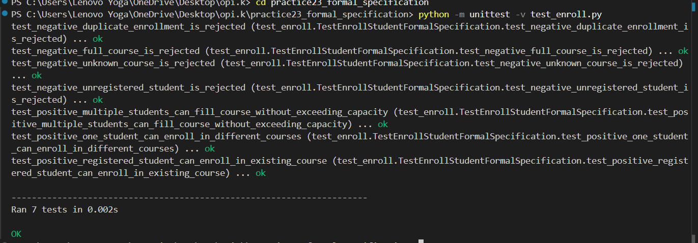

# Практична робота №23

Готовий комплект для здачі практичної роботи:

- `lab23_spec.md` - формальна специфікація операції `enroll_student(student_id, course_id)`;
- `enroll.py` - реалізація моделі запису студента на курс;
- `test_enroll.py` - перевірні сценарії для специфікації.
Демонстрація 

Запуск перевірки:


```bash
python -m unittest -v test_enroll.py
```
