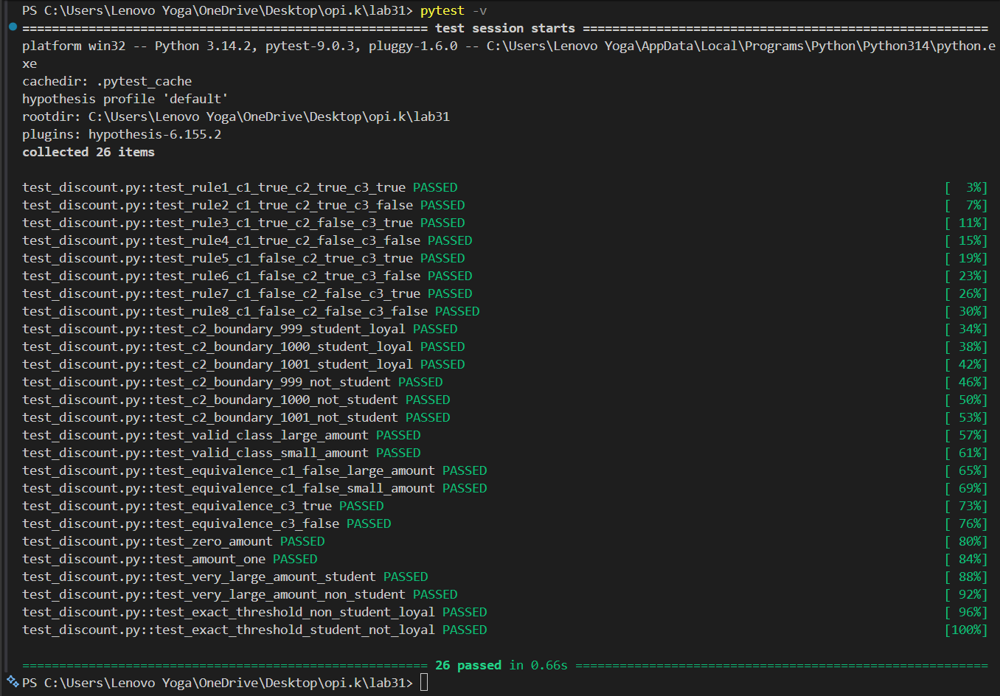

# Практична робота №31

## Методи доведення та верифікації програмних систем

## Тема 17. Базові методи доведення правильності програм


# Мета роботи

Побудувати Decision Table для функції з розгалуженою логікою, перетворити її на тестові кейси та оцінити повноту покриття варіантів.


# Крок 1. Опис функції

## Function

```python
calculate_discount(
    is_student: bool,
    order_amount: float,
    is_loyal_customer: bool
) -> int
```

## Description

Функція визначає розмір знижки залежно від:

- статусу студента;
- суми замовлення;
- статусу постійного клієнта.


# Conditions

### C1

Чи є користувач студентом?

### C2

Чи сума замовлення не менша за 1000 грн?

### C3

Чи є користувач постійним клієнтом?


# Крок 2. Decision Table

| Conditions | Rule1 | Rule2 | Rule3 | Rule4 | Rule5 | Rule6 | Rule7 | Rule8 |
|------------|--------|--------|--------|--------|--------|--------|--------|--------|
| C1 Student | Y | Y | Y | Y | N | N | N | N |
| C2 Amount >=1000 | Y | Y | N | N | Y | Y | N | N |
| C3 Loyal Customer | Y | N | Y | N | Y | N | Y | N |
| A1 Discount 25% | X | | | | | | | |
| A2 Discount 20% | | X | | | | | | |
| A3 Discount 15% | | | X | | | | | |
| A4 Discount 10% | | | | X | X | | | |
| A5 Discount 5% | | | | | | X | | |
| A6 Discount 3% | | | | | | | X | |
| A7 Discount 0% | | | | | | | | X |


## Перевірка вичерпності

Кількість умов = 3

Кількість комбінацій:

2³ = 8

У таблиці присутні всі 8 можливих комбінацій.

Висновок: таблиця є вичерпною.


## Перевірка несуперечності

Кожна комбінація умов зустрічається лише один раз та відповідає одній дії.

Висновок: таблиця є несуперечливою.


## Неможливі комбінації

Відсутні.

Усі 8 комбінацій умов є логічно можливими.


# Крок 3. Класи еквівалентності та граничні значення

## Condition C1

| Class | Range/Values | Representative | Boundary values |
|---------|---------|---------|---------|
| Valid | True | True | N/A |
| Invalid | False | False | N/A |


## Condition C2

| Class | Range/Values | Representative | Boundary values |
|---------|---------|---------|---------|
| Valid | >=1000 | 1500 | 999,1000,1001 |
| Invalid | <1000 | 500 | 999,1000 |


## Condition C3

| Class | Range/Values | Representative | Boundary values |
|---------|---------|---------|---------|
| Valid | True | True | N/A |
| Invalid | False | False | N/A |


# Крок 4. Реалізовані тестові кейси

## Decision Table Tests

- Rule 1 → test_rule1_c1_true_c2_true_c3_true
- Rule 2 → test_rule2_c1_true_c2_true_c3_false
- Rule 3 → test_rule3_c1_true_c2_false_c3_true
- Rule 4 → test_rule4_c1_true_c2_false_c3_false
- Rule 5 → test_rule5_c1_false_c2_true_c3_true
- Rule 6 → test_rule6_c1_false_c2_true_c3_false
- Rule 7 → test_rule7_c1_false_c2_false_c3_true
- Rule 8 → test_rule8_c1_false_c2_false_c3_false

Boundary Value Tests: 6

Equivalence Class Tests: 6

Additional Tests: 6

Загальна кількість тестів: 26


# Крок 5. Coverage Analysis

| Rule | Conditions | Action | Test Function | Status |
|--------|--------|--------|--------|--------|
| 1 | C1=Y,C2=Y,C3=Y | 25% | test_rule1_c1_true_c2_true_c3_true | COVERED |
| 2 | C1=Y,C2=Y,C3=N | 20% | test_rule2_c1_true_c2_true_c3_false | COVERED |
| 3 | C1=Y,C2=N,C3=Y | 15% | test_rule3_c1_true_c2_false_c3_true | COVERED |
| 4 | C1=Y,C2=N,C3=N | 10% | test_rule4_c1_true_c2_false_c3_false | COVERED |
| 5 | C1=N,C2=Y,C3=Y | 10% | test_rule5_c1_false_c2_true_c3_true | COVERED |
| 6 | C1=N,C2=Y,C3=N | 5% | test_rule6_c1_false_c2_true_c3_false | COVERED |
| 7 | C1=N,C2=N,C3=Y | 3% | test_rule7_c1_false_c2_false_c3_true | COVERED |
| 8 | C1=N,C2=N,C3=N | 0% | test_rule8_c1_false_c2_false_c3_false | COVERED |


## Boundary Values Coverage

| Boundary Value | Status |
|--------|--------|
| 999 | COVERED |
| 1000 | COVERED |
| 1001 | COVERED |


## Identified Gaps

Не виявлено.

Усі правила Decision Table покриті тестами.

Усі класи еквівалентності покриті тестами.

Усі граничні значення покриті тестами.
## Демонстрація


# Висновок

У ході виконання практичної роботи було реалізовано функцію нарахування знижки з трьома незалежними умовами. Для функції побудовано Decision Table з вісьмома правилами, визначено класи еквівалентності та граничні значення, а також розроблено набір із 26 тестових випадків. Аналіз покриття показав повне покриття всіх правил таблиці, класів еквівалентності та граничних значень. Це підтверджує коректність реалізованої логіки та ефективність методу аналізу варіантів для доведення правильності програм.