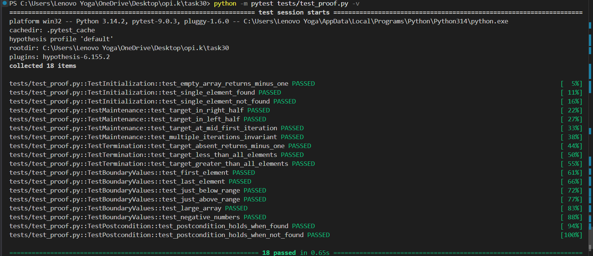

# Практична робота №30 — Доведення коректності алгоритму індукцією

**Алгоритм:** `binary_search` (бінарний пошук)  
**Метод доведення:** Loop invariant (аналог математичної індукції для циклів)

## Демонстрація

**результат:** `18 passed in 0.05s`

## Що доведено

| Властивість | Результат |
|-------------|-----------|
| target ∈ arr → повертає коректний індекс | Доведено (Maintenance, Гілка 1) |
| target ∉ arr → повертає -1 | Доведено (Termination) |
| Алгоритм завжди завершується | Доведено (монотонне зменшення high-low) |

**Примітка:** якщо у масиві є дублікати значень, алгоритм повертає деякий
індекс `i` такий, що `arr[i] == target`. Якщо потрібне перше або останнє
входження, алгоритм слід модифікувати відповідно.

## Групи тестів

| Група | Крок доведення | Тестів |
|-------|----------------|--------|
| TestInitialization | Initialization | 3 |
| TestMaintenance | Maintenance (усі 3 гілки) | 4 |
| TestTermination | Termination | 3 |
| TestBoundaryValues | Граничний аналіз | 6 |
| TestPostcondition | Postcondition | 2 |