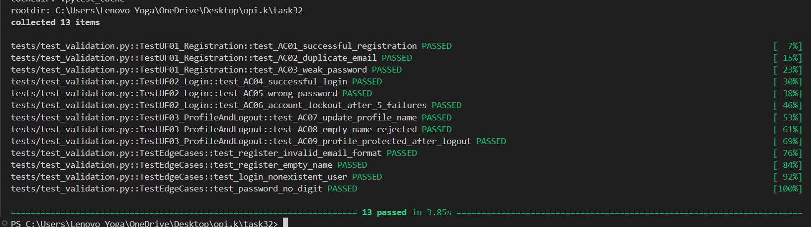

# Практична робота №32 — Валідаційне тестування

**Система:** TaskBoard — вебзастосунок для керування задачами (Flask)  
**Предмет:** Верифікація та валідація програм

## Демонстрація



### результат тестів

```
13 passed in 1.57s
```

## User Flows

| ID    | Назва                                    | Критичність |
|-------|------------------------------------------|-------------|
| UF-01 | Реєстрація нового користувача            | Висока      |
| UF-02 | Авторизація та блокування після 5 спроб  | Висока      |
| UF-03 | Оновлення профілю та захист після виходу | Висока      |

## API (для ручного тестування)

| Метод | Ендпоінт        | Опис                          |
|-------|-----------------|-------------------------------|
| POST  | /api/register   | Реєстрація (JSON)             |
| POST  | /api/login      | Вхід (JSON)                   |
| POST  | /api/profile    | Оновлення імені (JSON)        |
| GET   | /profile        | Профіль (сесія)               |
| GET   | /logout         | Вихід                         |
| POST  | /api/reset      | Скидання бази (для тестів)    |

### Приклад ручного тесту через curl

```bash
curl -X POST http://localhost:5000/api/register \
  -H "Content-Type: application/json" \
  -d '{"name": "Олексій", "email": "alex@test.com", "password": "secret123"}'

curl -X POST http://localhost:5000/api/login \
  -H "Content-Type: application/json" \
  -d '{"email": "alex@test.com", "password": "secret123"}'
```

## Звіт

Повний валідаційний звіт: [`reports/validation_report.md`](reports/validation_report.md)